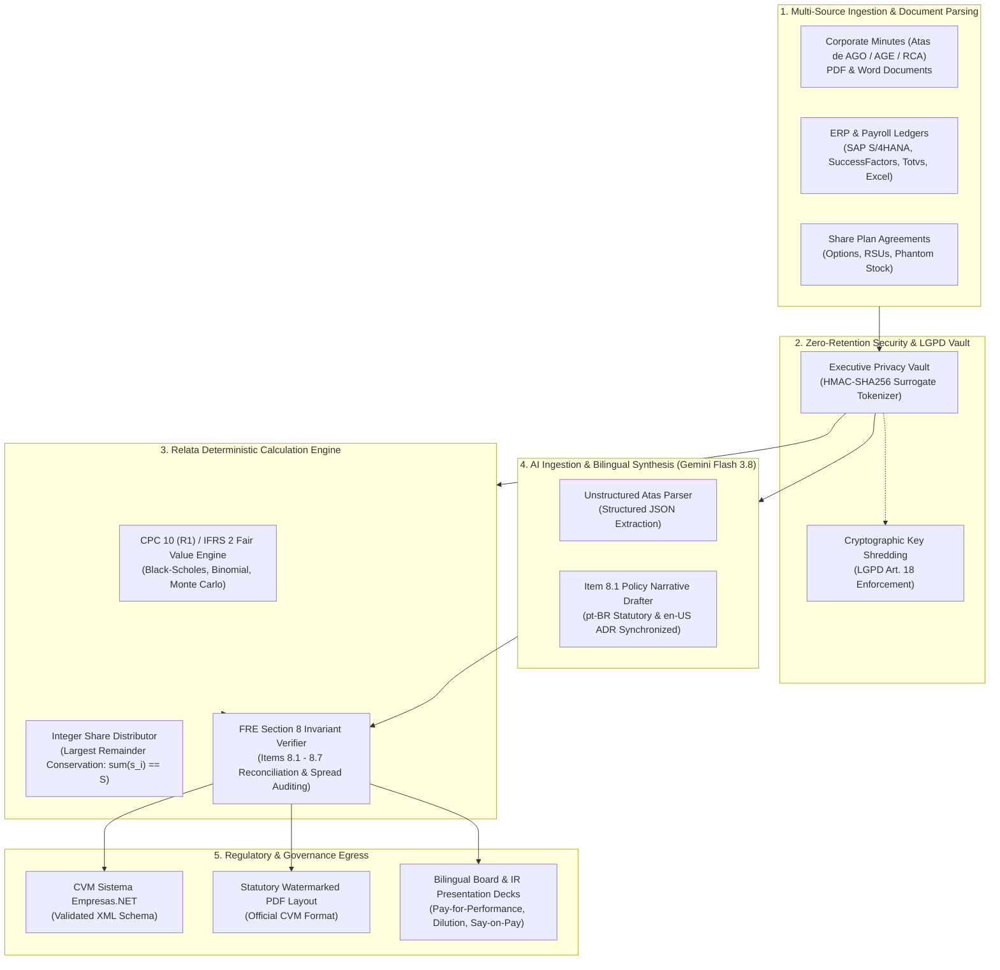

# Relata 🏛️

**Open-Source Enterprise CVM Regulatory Reporting & Disclosure Platform**  
*Deterministic Executive Compensation Engine for CVM Resolution 80/2022 (FRE Section 8) & CPC 10 (R1) / IFRS 2*

[](https://www.python.org/downloads/)
[](https://mypy-lang.org/)
[](https://github.com/astral-sh/ruff)
[](tests/)
[](docs/references/ResolutionCVM80.pdf)
[%20%7C%20IFRS%202-purple.svg)](docs/references/211_CPC_10_R1_rev%2014.pdf)
[](src/relata/security/privacy_vault.py)
[](src/relata/filing/empresas_net_xml.py)
[](src/relata/mcp/server.py)
[](LICENSE)

---

## 💡 Executive Summary

Every year, 450+ publicly traded companies listed on the Brazilian stock exchange (**B3**) face an intense regulatory, legal, and operational crunch to file **Section 8 ("Remuneração dos Administradores")** of the *Formulário de Referência* (FRE) under **CVM Resolution 80/2022**.

Companies spend millions in advisory fees manually reconciling fragmented payroll databases (SAP, Totvs, Senior HCM) against complex corporate accounting models (**CPC 10 R1 / IFRS 2** share-based payment amortizations) while risking severe regulatory fines from the CVM, legal injunctions over individual compensation disclosure (Item 8.6), and data privacy breaches under **LGPD (Art. 18)**.

**Relata** is the open-source, audit-grade platform that automates, reconciles, and validates executive compensation reporting:
1. **Deterministic vs. Probabilistic Boundary**: Generative AI (Gemini Flash 3.8) is strictly confined to unstructured document parsing (*Atas de AGO/AGE/RCA*) and bilingual narrative drafting (Item 8.1). All calculations (min/max/average spreads, Black-Scholes valuations, pro-rata amortization schedules) are formally verified by deterministic calculation modules.
2. **Exact Integer Share Conservation**: Allocates stock options and restricted shares across 36-to-48 month vesting schedules using the **Largest Remainder Method (Hamilton-Hare)**, guaranteeing the invariant $\sum s_i \equiv S_{\text{total}}$ with zero rounding drift.
3. **Dual-Language Statutory Parity**: Native synchronization across statutory Portuguese (**pt-BR**) and international English (**en-US**) for dual-listed ADR issuers, international institutional investors, and proxy advisors (ISS, Glass Lewis).
4. **Zero-Retention Executive Vault**: Bi-directional HMAC-SHA256 surrogate tokenization with cryptographic shredding to protect sensitive individual identities (CPF, names, individual packages) during AI inference and report generation.
5. **CVM Filing Ready**: Direct export to valid **Sistema Empresas.NET XML** alongside official watermarked PDF layouts.

---

## 🏛️ System Architecture



---

## 📐 Core Engineering & Mathematical Foundations

### 1. CPC 10 (R1) / IFRS 2 Black-Scholes Valuation
Under CPC 10 Item 16, stock option awards must be valued at fair value on grant date using continuous dividend Black-Scholes:
$$d_1 = \frac{\ln(S_0 / K) + \left(r - q + \frac{\sigma^2}{2}\right) T}{\sigma \sqrt{T}}, \quad d_2 = d_1 - \sigma \sqrt{T}$$
$$C = S_0 e^{-q T} N(d_1) - K e^{-r T} N(d_2)$$
Where $S_0$ is the spot stock price on B3, $K$ is the strike price, $r$ is the risk-free rate (NTN-B/CDI), $\sigma$ is annualized volatility, and $q$ is expected dividend yield.

### 2. Pro-Rata Temporis Expense Amortization with Forfeiture Rates
Under CPC 10 Item 19, expenses are recognized straight-line over the vesting period $M$, dynamically adjusted for annual forfeiture/turnover rates $\lambda$:
$$\text{Expense}_{\text{acc}}(m) = (S_{\text{total}} \times C) \times \left(\frac{m}{M}\right) \times (1 - \lambda)^{\frac{m}{12}}$$
$$\Delta \text{Expense}(m) = \text{Expense}_{\text{acc}}(m) - \text{Expense}_{\text{acc}}(m - 1)$$

### 3. Exact Share Conservation (Largest Remainder Method)
Standard floating-point rounding causes unvested share leakage across multi-year schedules. Relata enforces exact integer conservation via the Largest Remainder Method:
$$\sum_{i=1}^{M} s_i \equiv S_{\text{total}} \quad \forall S_{\text{total}} \in \mathbb{N}$$

---

## 🚀 Quickstart & Usage

### 1. Installation

```bash
git clone https://github.com/pedrogriff/relata.git
cd relata
pip install -e .
```

### 2. Deterministic CPC 10 Accrual Schedule

```python
from datetime import date
from decimal import Decimal
from relata.domain.cpc10_models import CPC10Grant, OptionPricingParameters
from relata.domain.enums import CorporateBody, SharePlanType
from relata.engine.cpc10_calculator import generate_cpc10_accrual_schedule

grant = CPC10Grant(
    grant_id="OUTORGA-2025-DIR",
    plan_name="Plano de Opções 2025 - Diretoria",
    corporate_body=CorporateBody.DIRETORIA_ESTATUTARIA,
    plan_type=SharePlanType.STOCK_OPTION,
    grant_date=date(2025, 1, 15),
    vesting_start_date=date(2025, 2, 1),
    vesting_months=36,
    total_shares_granted=120_000,
    pricing_parameters=OptionPricingParameters(
        spot_price_brl=Decimal("35.50"),
        strike_price_brl=Decimal("35.00"),
        risk_free_rate=Decimal("0.105"),
        annual_volatility=Decimal("0.32"),
        dividend_yield=Decimal("0.025"),
        time_to_maturity_years=Decimal("3.0"),
    ),
    grant_date_fair_value_unit_brl=Decimal("11.4520"),
    annual_forfeiture_rate=Decimal("0.03"),
)

schedule = generate_cpc10_accrual_schedule(grant)
print(f"Mes 1 Despesa Reconhecida: R$ {schedule[0].period_expense_recognized_brl:,.2f}")
print(f"Total Ações Vestidas: {sum(e.shares_vesting_in_month for e in schedule):,}")
```

### 3. Ingest Corporate Minutes (*Atas de AGO/AGE/RCA*) with Gemini Flash 3.8

```python
from relata.ingestion.extractor import AtaExtractor
from relata.ingestion.mapper import map_ata_to_fre_submission
from relata.engine.reconciler import reconcile_fre_section_8

# Ingest and sanitize meeting minutes (LGPD zero-retention CPF tokenization)
extractor = AtaExtractor()
extracted_data = extractor.extract(ata_text)

# Map into formal CVM FRE Section 8 container
submission = map_ata_to_fre_submission(extracted_data, fiscal_year=2025)

# Formally audit mathematical invariants before filing
report = reconcile_fre_section_8(submission)
assert report.is_valid is True
```

### 4. Generate Official CVM Sistema Empresas.NET XML

```python
from relata.filing.empresas_net_xml import generate_cvm_empresas_net_xml

# Generates standardized XML schema for official CVM upload
xml_filing = generate_cvm_empresas_net_xml(submission)
with open("CVM_FRE_Secao8_2025.xml", "w", encoding="utf-8") as f:
    f.write(xml_filing)
```

---

## 🔌 Model Context Protocol (MCP) Server

Relata exposes its full deterministic regulatory and accounting engine over the standardized **Model Context Protocol (protocolVersion: 2024-11-05)**, enabling local coding agents in **Claude Desktop** and **Cursor** to execute CVM compliance audits and option pricing directly via JSON-RPC 2.0 stdio:

### Registered MCP Tools

| Tool Name | Scope & Purpose |
| :--- | :--- |
| `relata_calculate_cpc10_fair_value` | Continuous dividend Black-Scholes call valuation under CPC 10 Item 16 / IFRS 2. |
| `relata_generate_cpc10_accruals` | Straight-line monthly P&L accrual schedule with forfeiture rate adjustment. |
| `relata_distribute_shares` | Integer share conservation via Largest Remainder Method (`sum(s_i) == S`). |
| `relata_reconcile_fre_section_8` | Deterministic invariant auditing for CVM FRE Section 8 tables and spread boundaries. |
| `relata_ingest_corporate_minutes` | Ingestion of *Atas de AGO/AGE/RCA* with LGPD Art. 18 zero-retention CPF tokenization. |
| `relata_generate_empresas_net_xml` | Direct export to validated CVM *Sistema Empresas.NET* XML schema. |

### Configuration (`claude_desktop_config.json` or Cursor MCP)

```json
{
  "mcpServers": {
    "relata": {
      "command": "python3",
      "args": ["-m", "relata.mcp"],
      "cwd": "/path/to/relata"
    }
  }
}
```

---

## 🧪 Testing & Verification

Relata enforces strict code health (>90% test coverage and zero MyPy type compromises):

```bash
# Run full unit & property test suite
pytest --cov=relata --cov-report=term-missing

# Strict linter and type-checker
ruff check .
mypy src
```

---

## 📄 License & Regulatory References

* **License**: Apache-2.0 open-source license.
* **CVM Resolution 80/2022**: [docs/references/ResolutionCVM80.pdf](docs/references/ResolutionCVM80.pdf)
* **CPC 10 (R1) / IFRS 2**: [docs/references/211_CPC_10_R1_rev 14.pdf](docs/references/211_CPC_10_R1_rev%2014.pdf)
* **Master Specification & Architecture**: [docs/cvc_system_dev_prompt.md](docs/cvc_system_dev_prompt.md)
